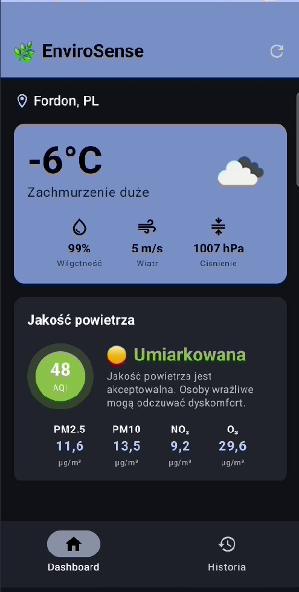
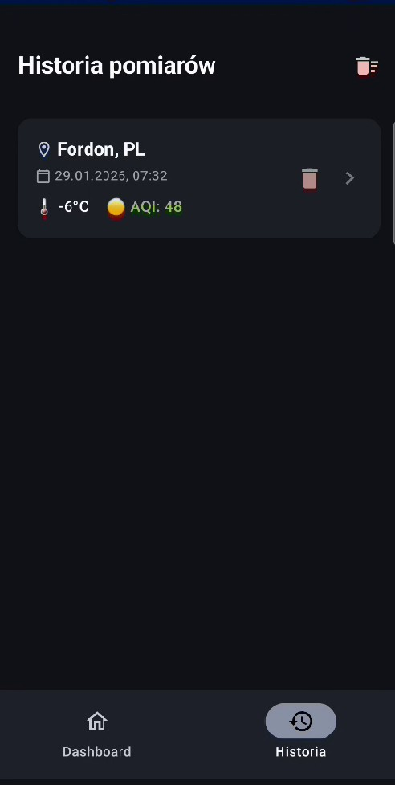
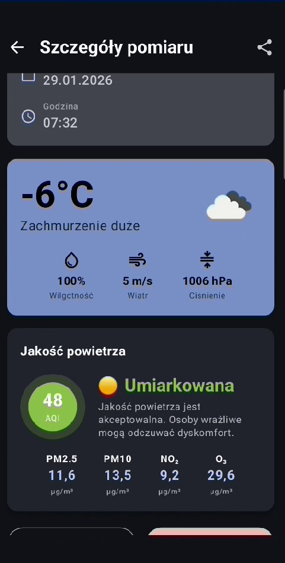

# EnviroSense

## Opis aplikacji

EnviroSense to aplikacja mobilna do monitorowania warunków środowiskowych. Pokazuje aktualną pogodę i jakość powietrza na podstawie lokalizacji użytkownika. Umożliwia zapisywanie pomiarów i przeglądanie historii.

## Jak działa aplikacja

1. **Uruchomienie** - aplikacja prosi o uprawnienia do lokalizacji
2. **Pobranie lokalizacji** - GPS pobiera współrzędne użytkownika
3. **Pobranie danych** - aplikacja wysyła zapytania do API OpenWeatherMap z współrzędnymi
4. **Wyświetlenie** - dane pogodowe i jakość powietrza pokazują się na Dashboard
5. **Zapis** - użytkownik może zapisać pomiar do lokalnej bazy Room
6. **Historia** - zapisane pomiary można przeglądać i usuwać

## Użyte sensory i źródła danych

| # | Źródło | Opis |
|---|--------|------|
| 1 | GPS | Pobieranie lokalizacji użytkownika |
| 2 | API OpenWeatherMap Weather | Temperatura, wilgotność, ciśnienie, wiatr |
| 3 | API OpenWeatherMap Air Pollution | Indeks AQI, PM2.5, PM10, NO₂, O₃ |

## Zrzuty ekranu

### Dashboard


### Historia pomiarów


### Szczegóły pomiaru


## Instrukcja uruchomienia

1. Sklonuj repozytorium
2. Otwórz projekt w Android Studio
3. W pliku `app/build.gradle.kts` wstaw swój klucz API OpenWeatherMap:
   ```kotlin
   buildConfigField("String", "OPENWEATHER_API_KEY", "\"twoj_klucz\"")
   ```
   Na stronie https://openweathermap.org/
4. Kliknij "Sync Project with Gradle Files"
5. Podłącz urządzenie lub uruchom emulator
6. Kliknij "Run"

## Autor

[Jakub Lebiodziński]

## Plik APK
Plik APK do testów znajduje się w folderze: `app\build\outputs\apk\debug\app-debug.apk`
!plik APK nie jest widoczyn w widoku Android studio
